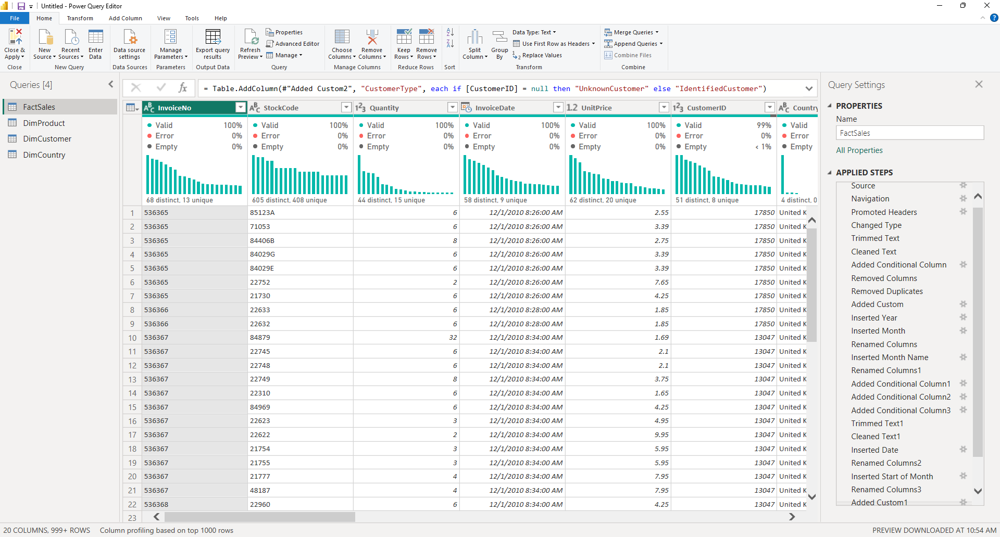
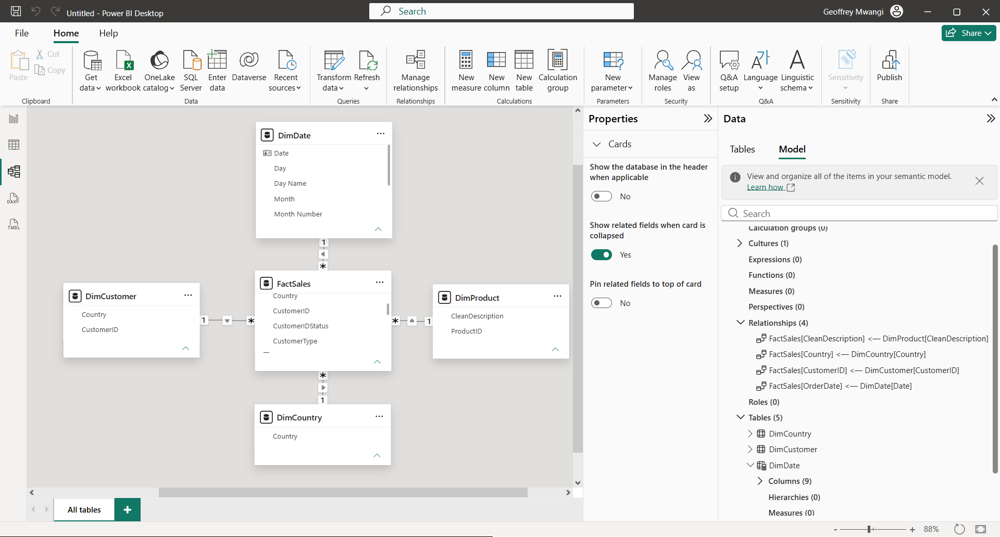
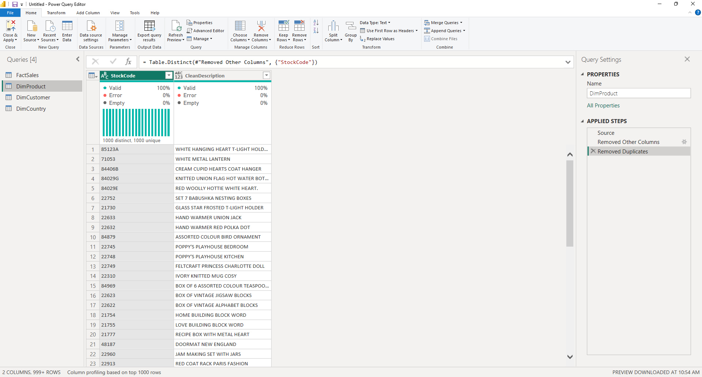
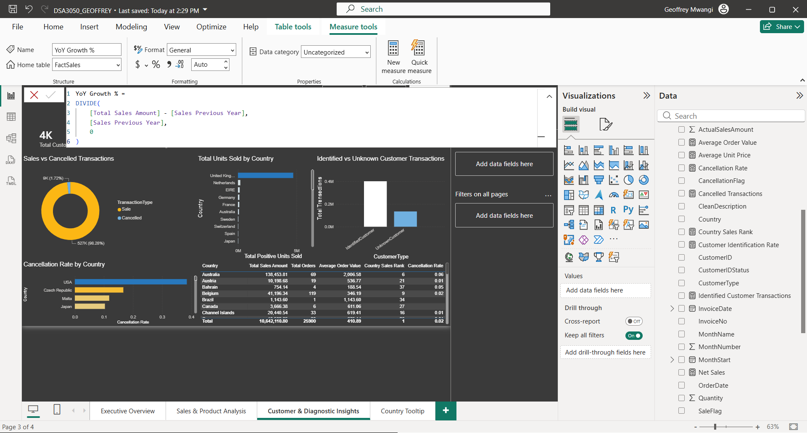
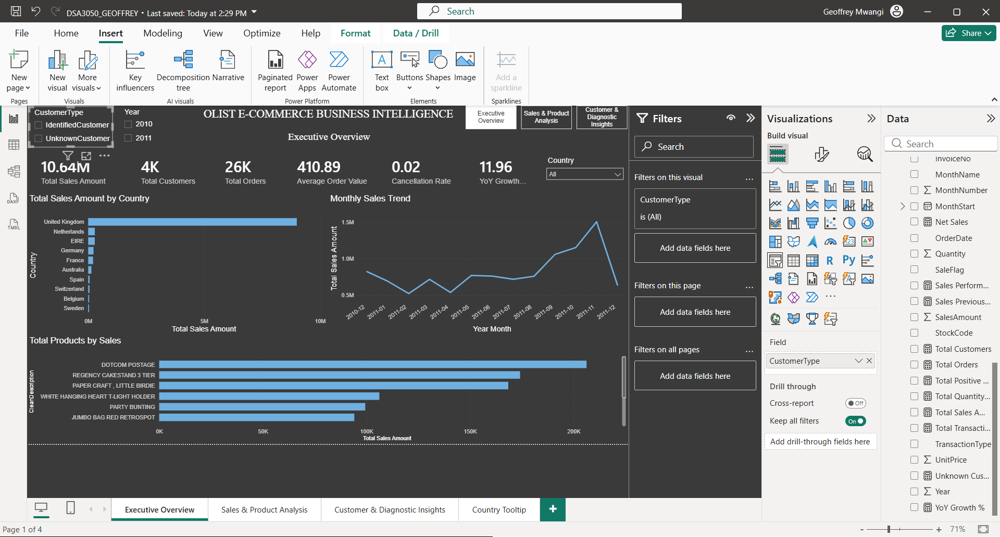
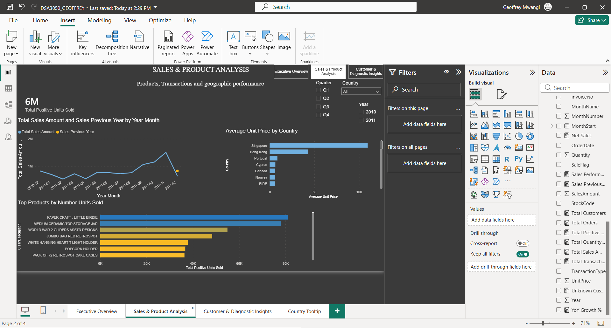
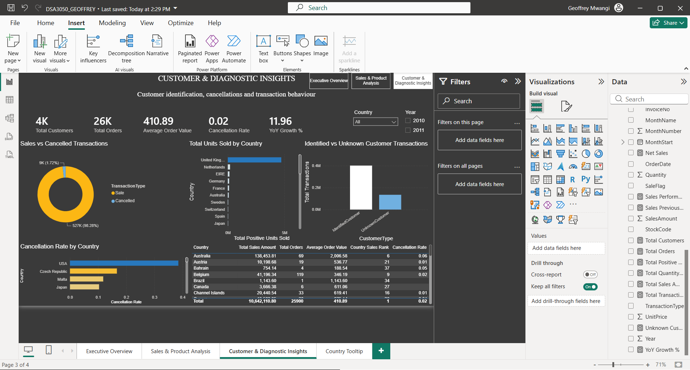

# DSA 3050A – Business Intelligence & Data Visualization

## Olist Online Retail Business Intelligence Dashboard

**Student:** Geoffrey Chege Mwangi  
**Registration Number:** 669566  
**Course:** DSA 3050A – Business Intelligence & Data Visualization  
**Software:** Microsoft Power BI Desktop  
**Dataset:** UCI Online Retail Dataset  

---

## 1. Project Overview

This project presents an end-to-end Business Intelligence solution developed in Microsoft Power BI using the **Online Retail dataset** from the UCI Machine Learning Repository.

The project follows the complete BI development process:

**Dataset → Power Query → Data Model → DAX → Dashboard → Business Insights**

The objective was to transform raw transactional retail data into an interactive analytical solution that can help an online retailer understand sales performance, customer activity, product performance, geographic markets, cancellations and purchasing trends.

The solution demonstrates:

- Real-world data acquisition and understanding
- Data cleaning and transformation using Power Query
- Analytical data modelling
- DAX measures and business calculations
- Interactive dashboard design
- Business interpretation
- GitHub documentation and evidence

---

## 2. Dataset

### Dataset Source

The dataset is the **Online Retail Dataset** from the UCI Machine Learning Repository.

**Official source:**  
UCI Machine Learning Repository – Online Retail  
https://archive.ics.uci.edu/dataset/352/online+retail

The dataset contains transactional records from a UK-based online retailer and covers transactions between **1 December 2010 and 9 December 2011**.

The original dataset contains more than **500,000 transaction records**, making it suitable for detailed business intelligence analysis.

### Dataset Variables

The main variables include:

| Variable | Description |
|---|---|
| `InvoiceNo` | Invoice or transaction identifier |
| `StockCode` | Product identifier |
| `Description` | Product description |
| `Quantity` | Number of units in the transaction |
| `InvoiceDate` | Date and time of the transaction |
| `UnitPrice` | Price per unit |
| `CustomerID` | Customer identifier |
| `Country` | Customer country |

Additional analytical fields were created during Power Query transformation, including:

- `SalesAmount`
- `NetSalesAmount`
- `OrderDate`
- `MonthStart`
- `Year`
- `MonthNumber`
- `MonthName`
- `TransactionType`
- `SaleFlag`
- `CancellationFlag`
- `CustomerType`
- `CustomerIDStatus`



---

## 3. Why This Dataset Was Selected

The Online Retail dataset was selected because it is a genuine real-world transactional dataset with sufficient size and complexity for Business Intelligence analysis.

It provides:

- More than 20,000 records
- Numerical variables such as quantity and unit price
- Categorical variables such as country, stock code and product description
- Date and time information
- A clear KPI opportunity through transaction value
- Multiple analytical dimensions including time, customers, products and geography
- Real data-quality issues requiring transformation

The dataset was particularly suitable because it allowed the project to demonstrate the complete process from raw data to business intelligence rather than simply creating charts from already-cleaned data.

---

## 4. Business Problem

The main business problem investigated in this project is:

> **How can an online retailer use transactional data to understand sales performance, customer activity, product performance and purchasing trends in order to identify opportunities and areas requiring attention?**

The Power BI solution was designed to help answer this problem through KPI analysis, trend analysis, product analysis, geographic analysis, customer analysis and cancellation analysis.

---

## 5. Analytical Questions

The dashboard was designed to answer the following questions:

1. How has sales performance changed over time?
2. Which countries generate the highest sales?
3. Which products contribute most to sales?
4. How many orders and customers are represented in the dataset?
5. What is the average order value?
6. How significant are cancelled transactions?
7. How does sales performance compare with the previous year?
8. What proportion of transaction records can be associated with an identified customer?
9. Which countries rank highest in terms of sales?
10. What areas of the business require further investigation?

---

# 6. Power Query – Data Cleaning and Transformation

Power Query was used extensively to transform the raw data before analysis.

The transformations were based on actual issues identified in the source dataset.

## 6.1 Data Type Correction

**Problem:** Several fields required appropriate data types for reliable analysis.

**Transformation:** Data types were explicitly corrected for identifiers, text fields, quantities, prices and date/time values.

**Reason:** Correct data types are required for accurate calculations, filtering and time-based analysis.

**Result:** The dataset contains appropriately typed fields such as Whole Number, Decimal Number, Text and Date/Time.

---

## 6.2 Text Cleaning

**Problem:** Text fields can contain unnecessary spaces or non-printing characters.

**Transformation:** Text fields such as `Description`, `StockCode` and `Country` were cleaned using Trim and Clean transformations.

**Reason:** Inconsistent text can result in duplicate-looking categories or incorrect grouping.

**Result:** Text values were standardised for analysis.

---

## 6.3 Missing Product Descriptions

**Problem:** Some records contained missing product descriptions.

**Transformation:** Missing descriptions were assigned the value `Unknown Product`.

**Reason:** Deleting the affected transactions would unnecessarily reduce the available transactional data.

**Result:** Missing descriptions were handled while preserving the underlying records.

---

## 6.4 Duplicate Records

**Problem:** Duplicate transaction rows were identified in the raw data.

**Transformation:** Exact duplicate rows were removed from the transaction query.

**Reason:** Duplicate records can cause transaction counts and sales calculations to be overstated.

**Result:** Exact duplicate records were removed from the analytical dataset.

---

## 6.5 Sales Amount

**Problem:** The raw dataset provides quantity and unit price separately rather than a direct transaction-value field.

**Transformation:** A custom column named `SalesAmount` was created.

**Formula:**

```text
SalesAmount = Quantity × UnitPrice
```

**Reason:** A monetary transaction-value field is required for meaningful sales KPIs.

**Result:** The dataset contains a calculated sales amount that can be aggregated and analysed.

---

## 6.6 Date Extraction

**Problem:** `InvoiceDate` contains both date and time information.

**Transformation:** Additional date fields were created, including `OrderDate`, `Year`, `MonthNumber`, `MonthName` and `MonthStart`.

**Reason:** These fields support time-series and period-based analysis.

**Result:** The dataset can be analysed by year, month and date.

---

## 6.7 Transaction Classification

**Problem:** Cancelled transactions are represented by invoice numbers beginning with `C`.

**Transformation:** A `TransactionType` field was created to classify records as either `Sale` or `Cancelled`.

**Reason:** Sales and cancellation activity need to be analysed separately.

**Result:** The dashboard can measure cancellation activity without deleting the original transactions.

---

## 6.8 Sale and Cancellation Flags

**Problem:** Binary indicators were needed for easier analytical calculations.

**Transformation:** `SaleFlag` and `CancellationFlag` fields were created.

**Reason:** Numeric flags can be efficiently used in business calculations and filtering.

**Result:** Sales and cancellation records can be identified consistently.

---

## 6.9 Customer Identification Status

**Problem:** A significant number of transactions have missing `CustomerID` values.

**Transformation:** A `CustomerType`/customer identification classification was created.

**Reason:** Transactions with unknown customers can still contribute to overall sales analysis, but should be distinguished from transactions with an identifiable customer.

**Result:** The dashboard can separately analyse identified and unknown customer transactions.

---

## 6.10 Power Query Evidence

The complete sequence of transformations can be seen in the Power Query screenshot below.


---

# 7. Data Model

The analytical model uses `FactSales` as the central transactional table.

The model includes:

- `FactSales`
- `DimDate`
- `DimCustomer`
- `DimCountry`
- `DimProduct`

The principal active relationships are:

```text
DimDate      1 ───── * FactSales
DimCustomer  1 ───── * FactSales
DimCountry   1 ───── * FactSales
DimProduct   1 ───── * FactSales
```

Single-direction filtering was used from the dimension tables toward the fact table.

## Fact Table

### FactSales

`FactSales` forms the centre of the model because it contains the individual transaction records from which sales, order and quantity metrics are calculated.

---

## Dimension Tables

### DimDate

`DimDate` provides the calendar structure required for time-based analysis and DAX time intelligence.

It contains fields such as:

- Date
- Year
- Month
- Month Number
- Month Short
- Year Month
- Quarter
- Day
- Day Name

### DimCustomer

`DimCustomer` provides the customer identifier and country information required for customer-oriented filtering and analysis.

### DimCountry

`DimCountry` provides a unique list of countries for geographic analysis.

### DimProduct

`DimProduct` was created as a reference table containing product identifiers and descriptions.

Product-level analysis in the final report also uses the transaction-level product fields contained in `FactSales`.

---

## Modelling Decisions

A star-schema-oriented approach was used to separate the central transactional table from descriptive dimensions where appropriate.

One-to-many relationships were used because one dimension record can correspond to many transaction records.

Single-direction filtering was selected to reduce ambiguity and prevent unnecessary bidirectional filter paths.

The model also includes a dedicated Date table because time analysis is an important part of the project.





---

# 8. DAX and Business Calculations

A set of business measures was developed to transform the raw model into meaningful analytical information.

The project contains more than the required minimum of 12 measures.

Important measures include:

- `Total Sales`
- `Total Transactions`
- `Total Orders`
- `Total Quantity Sold`
- `Positive Units Sold`
- `Average Unit Price`
- `Average Order Value`
- `Total Customers`
- `Identified Customer Transactions`
- `Unknown Customer Transactions`
- `Customer Identification Rate`
- `Cancelled Transactions`
- `Cancellation Rate`
- `Net Sales`
- `Sales Previous Year`
- `YoY Growth %`
- `Country Sales Rank`
- `Sales Performance Status`

The measures demonstrate functions and techniques including:

- `SUM()`
- `COUNTROWS()`
- `DISTINCTCOUNT()`
- `AVERAGE()`
- `CALCULATE()`
- `DIVIDE()`
- `RANKX()`
- `ALL()`
- `SAMEPERIODLASTYEAR()`
- `VAR`
- `SWITCH()`



---

# 9. Key DAX Measures

## Total Sales

```DAX
Total Sales =
SUM(FactSales[SalesAmount])
```

This calculates the total transaction sales amount within the current filter context.

It is used as a primary KPI throughout the dashboard.

---

## Total Orders

```DAX
Total Orders =
DISTINCTCOUNT(FactSales[InvoiceNo])
```

This calculates the number of distinct invoices/orders.

`DISTINCTCOUNT()` is used because one invoice can contain multiple transaction rows.

---

## Average Order Value

```DAX
Average Order Value =
DIVIDE(
    [Total Sales],
    [Total Orders],
    0
)
```

This calculates the average sales value per order.

`DIVIDE()` is used to safely handle situations where the denominator is zero.

---

## Cancellation Rate

```DAX
Cancellation Rate =
DIVIDE(
    [Cancelled Transactions],
    [Total Transactions],
    0
)
```

This measures the proportion of transaction records classified as cancelled.

It is useful for identifying potential operational or customer-service issues.

---

## Sales Previous Year

```DAX
Sales Previous Year =
CALCULATE(
    [Total Sales],
    SAMEPERIODLASTYEAR(DimDate[Date])
)
```

This calculates sales for the corresponding period in the previous year.

The measure relies on the dedicated `DimDate` table.

---

## YoY Growth %

```DAX
YoY Growth % =
DIVIDE(
    [Total Sales] - [Sales Previous Year],
    [Sales Previous Year],
    0
)
```

This measures year-over-year sales growth or decline.

It allows current performance to be compared with the equivalent previous-year period.

---

# 10. Dashboard Design

The Power BI report contains three main analytical pages.

The dashboard progression follows:

**Overview → Detailed Analysis → Deeper Insights**

This was designed to move from management-level performance to more detailed and diagnostic analysis.

---

## Page 1 – Executive Overview

The Executive Overview presents the main business KPIs and high-level performance.

It includes:

- Total Sales
- Total Customers
- Total Orders
- Average Order Value
- Cancellation Rate
- YoY Growth
- Monthly Sales Trend
- Sales by Country
- Top Products by Sales
- Interactive slicers

The purpose of the page is to allow a manager to understand the major performance story quickly.



---

## Page 2 – Sales & Product Analysis

The second page provides a deeper analysis of sales and product performance.

It focuses on:

- Sales by country
- Top products
- Units sold
- Average unit price
- Sales trends
- Current versus previous-year sales
- Interactive filtering by time and geography

The page is designed to answer:

> Which products and markets are driving sales performance?



---

## Page 3 – Customer & Diagnostic Insights

The third page investigates customer identification, cancellations and diagnostic business patterns.

It includes analysis of:

- Total customers
- Customer identification rate
- Cancelled transactions
- Cancellation rate
- Sales by country
- Cancellation rate by country
- Country sales ranking
- Identified versus unknown customer transactions

The purpose of this page is to move from:

**What happened?**

towards:

**Where is attention required?**



---

# 11. Dashboard Interactivity

The report includes interactive features including:

- Year slicers
- Country slicers
- Customer type filtering
- Cross-filtering between visuals
- Page navigation
- Report-page tooltip functionality

These features allow users to interact with the analytical story rather than viewing a collection of static charts.

---

# 12. Business Insights

The completed dashboard highlights several important patterns.

### Sales concentration

The United Kingdom is the dominant market in the dataset by sales, with the remaining major markets contributing substantially smaller amounts. This indicates a strong geographic concentration in the recorded business activity.

### Product concentration

A relatively small number of products generate a large proportion of transaction sales. The top-product analysis makes it possible to identify products that contribute disproportionately to revenue.

### Time performance

The monthly sales trend shows substantial variation over the observation period, with sales increasing toward the later part of the dataset and a pronounced peak before the final period.

### Cancellations

The dashboard identifies cancelled transactions as a measurable component of overall transaction activity. Monitoring cancellation rate provides an indicator that management can investigate further.

### Customer data completeness

A significant portion of the raw transactions do not contain an identifiable `CustomerID`. This does not prevent overall sales analysis, but it limits the reliability of customer-level analysis and represents an important data-quality consideration.

### Management implication

The dashboard suggests that management should pay particular attention to:

- maintaining performance in the strongest geographic markets
- understanding the characteristics of high-performing products
- monitoring cancellation behaviour
- improving customer data completeness
- tracking changes in sales performance over time

These observations should be interpreted together with the interactive filters in the Power BI report.

---

# 13. Limitations

The project has several data-related limitations.

### Missing Customer IDs

Many records do not contain a CustomerID, limiting reliable customer-level analysis.

### Transaction-level product information

Product information is primarily available at transaction level, so product analysis is based on the transaction fields contained in `FactSales`.

### Cancellation and negative quantities

The source data represents cancellations/returns using negative quantities and invoice conventions. These records were retained so that the business impact of cancellations could be analysed rather than silently discarded.

### Historical scope

The dataset covers a historical period and should not be interpreted as a representation of current retail performance.

---

# 14. Conclusion

This project demonstrates the complete Business Intelligence development process using a real-world retail transaction dataset.

The solution progresses through:

```text
Raw Dataset
     ↓
Power Query Cleaning
     ↓
Analytical Data Model
     ↓
DAX Measures
     ↓
Interactive Dashboards
     ↓
Business Insights
```

The final Power BI solution provides management-oriented KPIs, detailed sales analysis, geographic analysis, product analysis, customer-data analysis and diagnostic insights.

The project therefore demonstrates not only data visualization, but also the transformation of raw data into a structured Business Intelligence solution.

---

# 15. Project Structure

```text
DSA3050-PowerBI-Geoffrey-Chege-Mwangi-669566/
│
├── README.md
│
├── data/
│   └── Online Retail.xlsx
│
├── powerbi/
│   └── DSA3050_OnlineRetail_BI.pbix
│
└── screenshots/
    ├── dax_measures.png
    ├── dashboard_diagnostics.png
    ├── dashboard_sales.png
    ├── dashboard_executive.png
    ├── data_model.png
    ├── reference_tables.png
    └── power_query.png
```

---

## 16. Evidence

The repository contains screenshots documenting the major stages of development:

- Power Query transformations
- Reference/dimension tables
- Data model
- DAX measures
- Executive dashboard
- Detailed sales dashboard
- Diagnostic dashboard